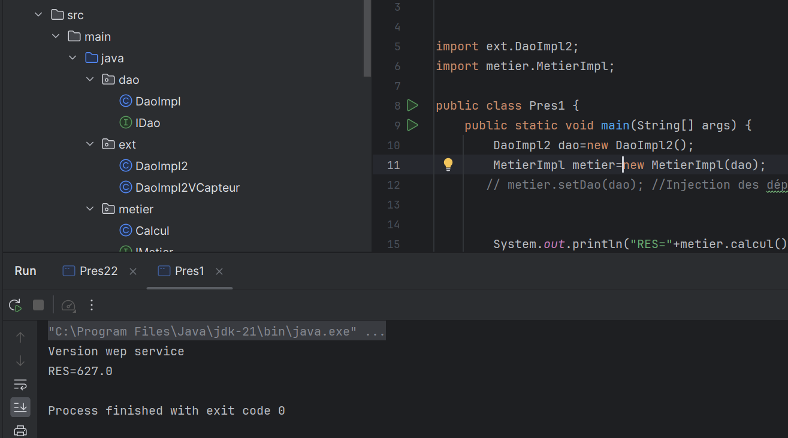
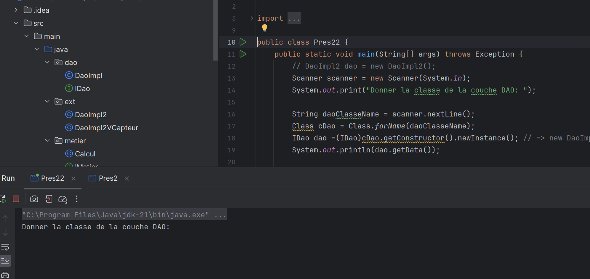
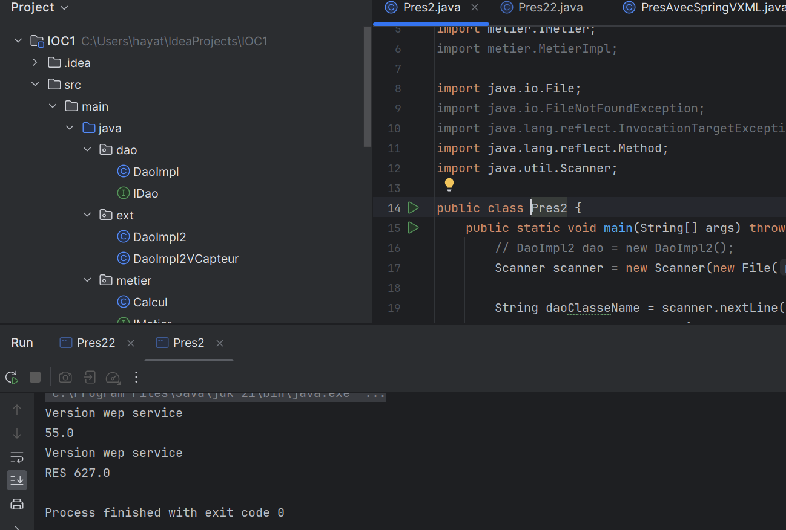
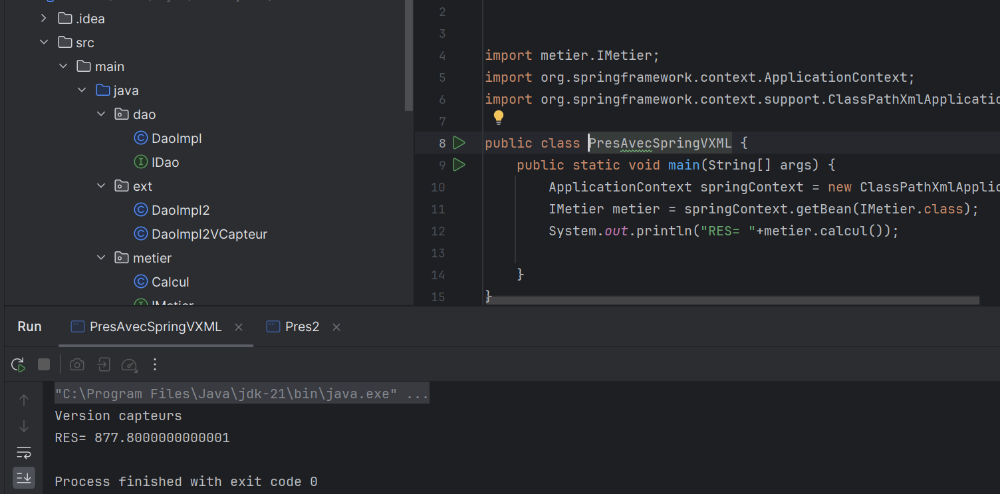
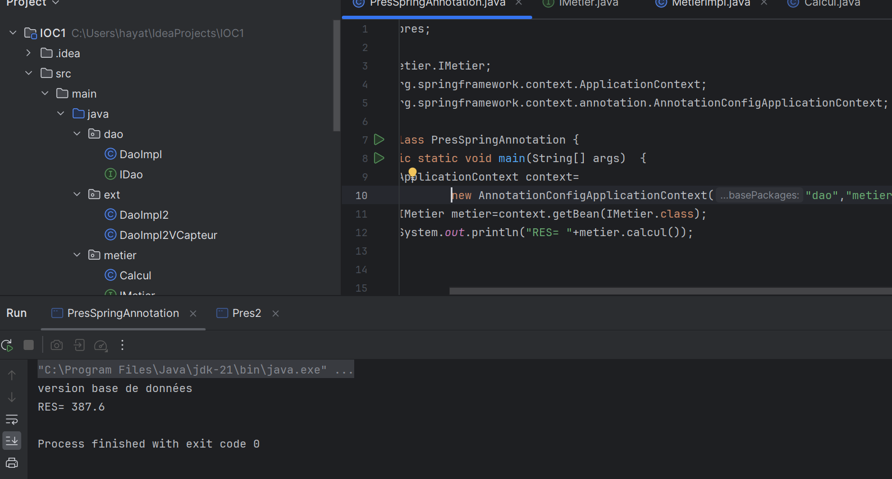

<h2>instanciation statique</h2>

Description du capteur 1.

    
    
   
   
<h2>instanciation dynamique</h2>

    
   

<h2>Version XML</h2>
  
    

<h2>Version annotations</h2>

Description du capteur 4.

   

  
    
